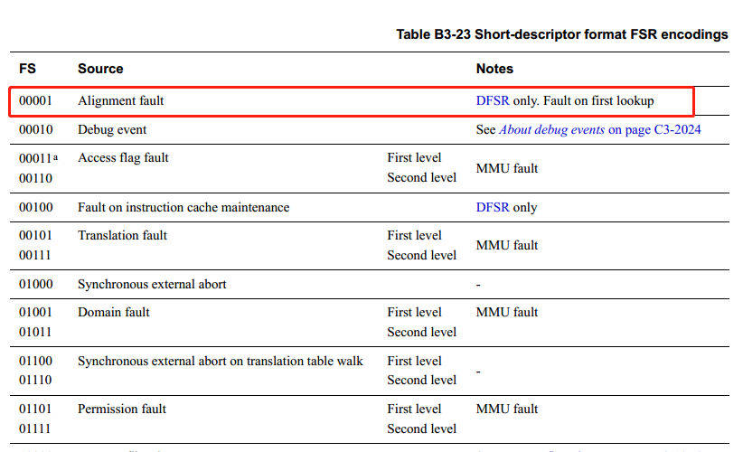

# Armv7-A 系列芯片异常调试方法

本周解决了两个在 Armv7-A 系列芯片上出现的错误，包括一个由于软浮点配置导致的未定义指令错误以及一个由于数据未对齐导致的 data abort 错误，通过解决这两个问题，学会了如何在 A 系列芯片上根据错误调用栈来 debug，进而找出错误原因并修正。

## Undefined instruction

首先是一个 undefined instruction 错误，通过系统的 pc 指针减去 4 的位置（因为是 ARM 模式所以要 -4）找到出错位置的反汇编指令，发现是一个硬浮点指令，进而发现系统中没有开启芯片系统中的硬浮点处理功能。本来想开启该功能，后来发现在线程切换等地方没有对先关的硬件浮点寄存器压栈，因此这条路暂时走不通，因此在编译的时候重新指定使用软浮点来进行计算，就解决了这个 undefined instruction 的错误。出现这个问题的原因是系统的 cp15 协处理器的硬浮点计算功能没有开启，此时系统不支持该硬浮点运算指令，当系统看到该指令时，就会出现错误。

## Data abort

另外一个问题发生在当想把新开发版上开发的程序运行在 microzed 开发板上的时候，运行一会儿就会出现 data abort。

解决这个问题是通过查询 arm-v7 说明手册（1477 页）将 DFAR（数据错误地址寄存器）和 DFSR（数据错误状态寄存器）中的值通过汇编指令在异常出现时打印出来，指令如下：

```asm
asm volatile ("mrc p15, 0, %0, c6, c0, 0\n" : "=r" (data_addr)); Read DFAR into data_addr
```

发现错误地址是一个非四字节对齐的地址，猜想错误是由于非对齐取数据造成的。通过观察 DFSR 中的值，指令如下：

```asm
asm volatile ("MRC p15, 0, %0, c5, c0, 0\n" : "=r" (data_stat)); Read DFSR into data_stat
```

得出错误的原因是确实是数据未对齐（验证了先前的猜想）。




