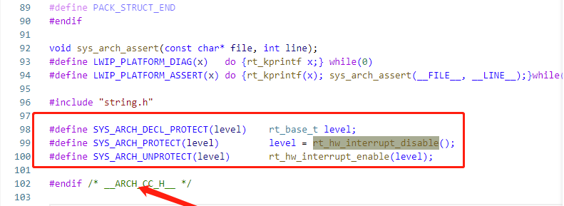

# lwip 中内存分配机制说明

在 lwip 系统中的内存申请可以配置为从多个位置分配内存，例如从 lwip 自带的内存池中和内存堆中。在 rt-thread 中接管了 lwip 的堆内存分配，因此如果调用 lwip 的接口尝试从堆中分配内存，那么将会从 rt-thread 的系统堆管理器中进行分配。

但是 rt-thread 的堆管理器和 lwip 自带的堆管理器有所不同，当使用 lwip 的 mem.c  中的内存管理算法进行内存分配时，`LWIP_ALLOW_MEM_FREE_FROM_OTHER_CONTEXT` 宏会影响分配器的行为。

```c
/**
 * Set this to 1 if you want to free PBUF_RAM pbufs (or call mem_free()) from
 * interrupt context (or another context that doesn't allow waiting for a
 * semaphore).
 * If set to 1, mem_malloc will be protected by a semaphore and SYS_ARCH_PROTECT,
 * while mem_free will only use SYS_ARCH_PROTECT. mem_malloc SYS_ARCH_UNPROTECTs
 * with each loop so that mem_free can run.
 *
 * ATTENTION: As you can see from the above description, this leads to dis-/
 * enabling interrupts often, which can be slow! Also, on low memory, mem_malloc
 * can need longer.
 *
 * If you don't want that, at least for NO_SYS=0, you can still use the following
 * functions to enqueue a deallocation call which then runs in the tcpip_thread
 * context:
 * - pbuf_free_callback(p);
 * - mem_free_callback(m);
 */

#define LWIP_ALLOW_MEM_FREE_FROM_OTHER_CONTEXT 0
```

当这个宏设置为 1 时，将会允许 lwip 系统在中断上下文中释放 PBUF_RAM 的内存，这一操作是通过在分配和释放内存过程前后加保护（**信号量和关中断**）来实现的。而在 rt-thread 操作系统中，堆内存分配过程并不允许在中断上下文中进行，对于内存的分配和释放过程只是使用了**信号量**来做保护，这就带来了潜在的重入风险。

## 修改 lwip 临界区保护机制

RT-Thread lwip 的移植版本默认使用关调度的方式来做临界区保护，如果使用这种方式保护内存申请与释放过程，就不允许在中断中也进行内存的申请和释放，因为中断下的内存申请和释放过程会重入线程内的内存申请和释放。

如果在驱动中断里进行内存的申请和释放难以避免，那么就需要修改 lwip 的临界区保护机制为关中断，如下图所示：



上面的改动不能完全保证所有的申请释放过程都被保护，还需要检查驱动中的具体实现，是否仍然有可能出现中断里的内存申请释放操作重入线程状态下 lwip 内存申请释放的情况。

因为有些驱动独立维护了一套 pbuf 的缓冲区，可能带来潜在的重入风险，例如 free 函数的重入，下面的内容就记录了一次因 free 函数被重入导致 bug 的排错过程。

## 错误查找过程分析

### 出错现场

第一次出现这个错误的情况如下：

1. 开发板直连到电脑

2. 想使用静态 IP 与电脑进行 iperf 测试

3. 在系统 link up 的过程中，突然有一次出现了 data abort

经过初步排查，发现错误出现在内存 free 的过程中，但是不清楚是什么行为触发了这个 bug。后来经过测试，发现频繁地拔插网线时，当网络速度协商为 100M 的情况下，有一定概率触发 data abort。 后续通过指定协商速率为 100M 的方法，尝试加速错误复现。

### 分析过程

后续一方面开始怀疑网络协议栈有问题，另一方面开始怀疑 emac 控制器的配置是否出错，因此尝试屏蔽 lwip 的的输入和输出，发现当 lwip 不进行数据收发的时候，错误不再复现。然后进一步发现，当打开 lwip 的输出时错误可以复现，因此可以确定错误出现在 lwip 进行数据输出的过程中的某个内存 **free** 动作上。

然后注意到每次 bug 出现的时候调用栈显示都是在 phy 检测线程中，但是仔细检查该线程，并没有任何内存释放动作，因为该线程并不直接进行数据收发，而是通过邮箱的方式通知 lwip 线程进行数据收发，那就奇怪了，如果错误出现在线程中，那么一定能在线程的执行过程中找到内存释放动作，这说明，内存释放动作出现在中断里，是中断打断了该线程的运行。

接下来仔细检查发送中断处理函数，果然发现了在中断处理函数中也进行了堆内存的释放，而 rt-thread 的堆控制器是不允许在中断中进行内存释放的。进一步排查，发现每次 link up 后 lwip 将要向外发送 arp 数据包，该数据包在发送后会在线程环境中进行内存释放，而在中断里，同样会释放该数据包。

这就引入了 free 函数被重入的风险，而由于中断的优先级是最高的，因此可以推断出，是中断处理函数中的 free 函数重入了线程中的 free。如果 arp 包的发送过程完成后，先触发中断，先在内存中进行中断释放，然后退出中断时再次在线程中进行释放该内存，会发现该指针为 null，此时不会出现错误。

而如果反过来，发送完成后先在线程环境中尝试释放，释放过程进行到一半，在中断里再次进行释放，修改了内存堆的链表，将其写为空，那么当返回线程环境时，就有可能访问到空指针，进而导致 data abort 错误。 

### 复现方法

考虑如下情况：

1. 调用 lwip 发送接口发送一个从系统堆中申请内存的数据包
2. 发送完成后对该块内存进行释放 
3. 在释放的过程中发生中断，在中断中再次释放该内存
4. 中断退出后，继续内存释放过程，此时重入发生，造成未知错误

## 解决方案

此时如果想要避免出现这种重入的情况，就不能在中断里尝试进行堆内存的释放，为了处理这种情况，lwip 提供了两种方法来解决。

### 方案一

使用 lwip 自带的堆管理器，该堆管理器在允许在中断上下文进行内存分配和释放的情况下，会在内存操作过程前后加上（**信号量和关中断**）来保护内存分配过程。这种问题就目前来说有两个缺点，一个是关闭中断次数过多，使得系统响应速度变慢，而是需要切换堆管理器，目前不可取。

### 方案二

使用 lwip 提供的一种延时释放机制，也就是替换相应的内存释放函数为  `pbuf_free_callback(p)` 和`mem_free_callback(m)` 。如果在中断里调用这两个函数来释放内存，则不会立刻释放，而是向 `tcpip` 线程发邮件，当中断退出后，在 `tcpip` 线程中收到邮件，然后执行 call back 进行内存释放。

使用这种方案解决问题比较简单，只需要将 `pbuf_free` 函数进行修改即可，修改后的代码如下所示：

```c
      {
        /* is this a pbuf from the pool? */
        if (alloc_src == PBUF_TYPE_ALLOC_SRC_MASK_STD_MEMP_PBUF_POOL) {
          memp_free(MEMP_PBUF_POOL, p);
          /* is this a ROM or RAM referencing pbuf? */
        } else if (alloc_src == PBUF_TYPE_ALLOC_SRC_MASK_STD_MEMP_PBUF) {
          memp_free(MEMP_PBUF, p);
          /* type == PBUF_RAM */
        } else if (alloc_src == PBUF_TYPE_ALLOC_SRC_MASK_STD_HEAP) {
          mem_free_callback(p);   /* change mem_free to mem_free_callback */
        } else {
          /* @todo: support freeing other types */
          LWIP_ASSERT("invalid pbuf type", 0);
        }
      }
```

## 结论

如果对内存系统的原理搞不清楚，内存分配又会同时发生在线程环境和中断环境，此时就有内存分配过程被重入的危险（**当然都是中断去重入线程，因为中断优先级最高**），系统中出现的错误很多时候都是由于内存出了问题。重入问题由于其发生时的情况不定，错误时间不定，因此相对难于排查。

因此，要对系统中的内存分配机制做到心中有数，对这一块的分配算法十分熟悉才行。