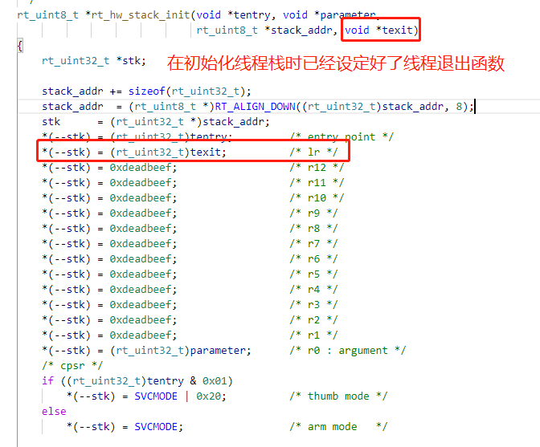
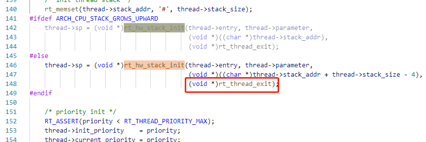
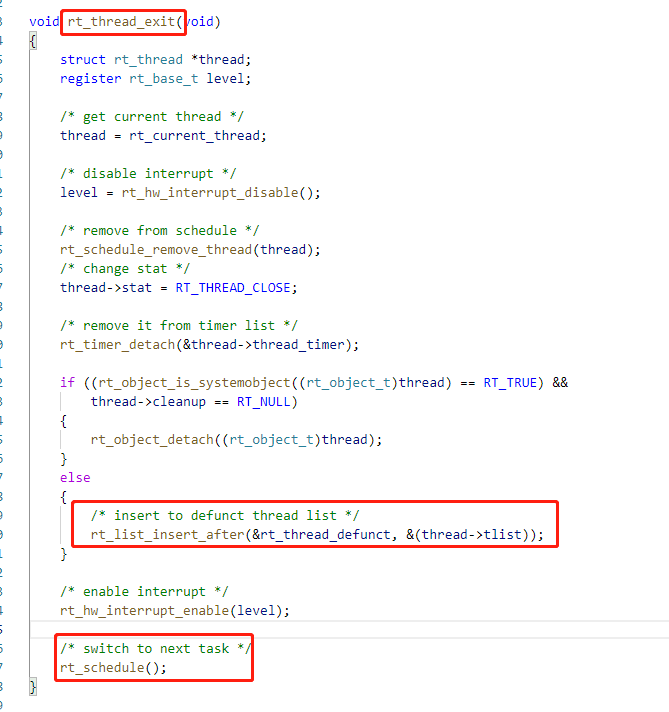

# 线程退出后可以释放自己吗

根据开发经验，系统中很多错误都是由于资源延时释放导致的，例如在 IDLE 中释放一些系统中不再使用的资源。当然这其中也包括已经退出的线程本身原先所占用的资源。那么有一个问题就出现了，既然延时释放资源可能会带来这么多问题，那么线程退出后能否自己释放自己所占用的资源呢？这是个值得考虑的问题。

## 线程为什么不能在退出前释放自己的资源

在 RT-Thread 系统中，线程本身的资源主要有两个，一个是线程控制块，一个是线程的栈，现在的问题是线程是否可以在退出前释放自己的资源？

答案是不可以的，因为无论是释放线程控制块还是线程栈，在释放资源后，一旦出现中断或者线程切换导致线程让出，再回来的时候，由于本线程的资源已经被释放，因此运行时环境就是错误的，无论是线程控制块还是栈都可能已经被改写，此时继续运行就会出现系统崩溃。

更详细一点说明，如果是先释放任务控制块，在释放完毕时，发生中断导致系统切换到其他线程中，在该线程中也申请内存，进而改写了原任务的任务控制块数据，此时如果想切换回原任务，但是任务控制块已经被破坏了，就会导致系统崩溃。先释放栈也是一个道理，都是不能允许的操作。

## 那么是否能做到让线程自己释放自己的资源而不崩溃呢？

在释放自己资源的时候关闭系统中断，不让这块内存被其他任务申请走，这时候释放完资源，这些资源还没有被其他任务改写，此时使用直接切线程的方式切换到其他线程中，这时系统还能继续运行下去而不会出现崩溃。

## 线程自然退出时会执行什么

首先线程本身也是一个函数，是函数就自然有函数返回地址，在进行线程初始化的时候，就将该线程的返回函数设置好了，也就是 `void rt_thread_exit(void)` 函数的地址，也就是将该函数的地址放到 LR 寄存器中，因此当函数返回时，就会去执行  `void rt_thread_exit(void)` 函数执行相应的后续处理函数。

- 栈初始化函数
    

- 线程初始化时线程初始化函数被调用
    

- 退出函数将该废弃线程从调度列表中删除，然后加入到废弃线程列表中
    

在处理线程退出的过程中，会移除线程控制块，将自己从内核对象列表中移除，再将自己挂到废弃线程列表中，等待在 idle 线程中释放自己的资源。最后调用 schedule 函数切换到其他线程中运行。

